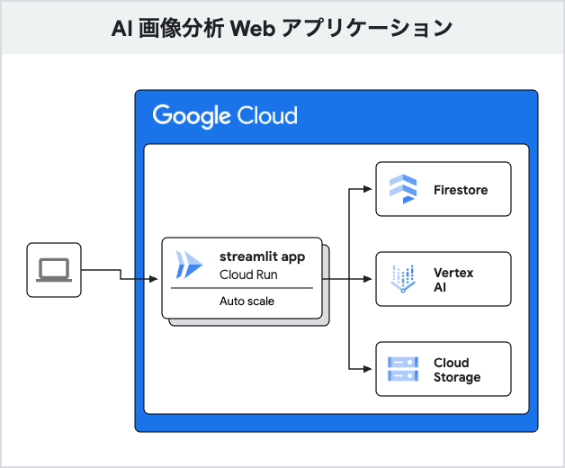
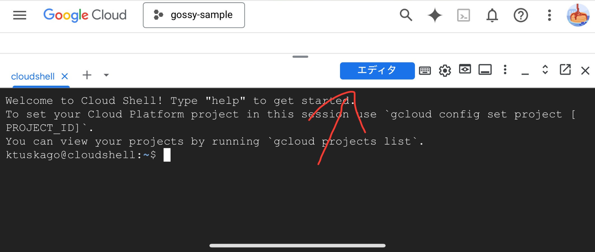

# ハンズオン: Google Cloud で AI 画像分析 Web アプリを作ろう！ (Gemini, Cloud Run, Firestore)

**最終更新:** 2025年4月11日

このリポジトリは、Google Cloud の各種サービスを組み合わせて AI 画像分析 Web アプリケーションを構築するハンズオンワークショップのガイドです。Cloud Shell Editor を開発環境として使用し、Streamlit アプリを作成、Cloud Storage への画像アップロード、Gemini API での分析、Firestore への履歴保存、そして Cloud Run への直接デプロイまでをステップバイステップで学習します。(Git および CI/CD 手順は含みません)



## 目次

* [対象者](#対象者)
* [学習目標](#学習目標)
* [所要時間 (目安)](#所要時間-目安)
* [必要なもの](#必要なもの)
* [モジュール 1: 開発環境のセットアップ Cloud Shell Editor](#モジュール-1-開発環境のセットアップ-Cloud-Shell-Editor)
* [モジュール 2: 基本的な Web アプリの作成 (Streamlit)](#モジュール-2-基本的な-web-アプリの作成-streamlit)
* [モジュール 3: 画像アップロード機能の追加 (Cloud Storage)](#モジュール-3-画像アップロード機能の追加-cloud-storage)
* [モジュール 4: アプリの Cloud Run へのデプロイ (ソースコードから)](#モジュール-4-アプリの-cloud-run-へのデプロイ-ソースコードから)
* [モジュール 5: AI による画像分析機能の追加 (Gemini API)](#モジュール-5-ai-による画像分析機能の追加-gemini-api)
* [モジュール 6: 分析履歴の保存 (Firestore)](#モジュール-6-分析履歴の保存-firestore)
* [モジュール 7: 履歴の表示 (Firestore & GCS 画像)](#モジュール-7-履歴の表示-firestore--gcs-画像)
* [まとめ と 次のステップ](#まとめ-と-次のステップ)
* [参考: 必要な IAM ロール](#参考-必要な-iam-ロール)

## 対象者

* Google Cloud をこれから学びたい方、初学者の方
* Python の基本的な知識がある方
* Web アプリケーション開発・デプロイに興味がある方

## 学習目標

* Cloud Shell Editor を使ったクラウドベースの開発環境の利用方法
* Streamlit を使った簡単な Web アプリケーションの作成
* Cloud Storage へのファイルアップロード機能の実装
* `gcloud` コマンドを使った Cloud Run への直接デプロイ (ソースコードから)
* Gemini API (Vertex AI) を使った画像分析の実装
* Firestore を使った NoSQL データベースへのデータ保存と読み取り

## 所要時間 (目安)

* 1〜2 時間

---
## モジュール 0: コンソールを開く
[https://console.cloud.google.com/]


## モジュール 1: 開発環境のセットアップ Cloud Shell Editor

クラウド上でコーディングできる、便利な開発環境を準備します。

1.  **Cloud Shell Editor の起動:**
    * ナビゲーションメニューから Cloud Shell を起動します。
     * 
    * Cloud Shell Editor を起動します
     * 

クラウド上の開発環境が立ち上がりました。

---

## モジュール 2: 基本的な Web アプリの作成 (Streamlit)

シンプルな Web アプリを作成します。

1.  **必要なツールの確認とインストール:**
    * ターミナルを開きます ([Terminal] > [New Terminal])。
    * Python 仮想環境ツール `venv` が必要です。インストールします:
        ```bash
        sudo apt update
        sudo apt install python3-venv -y
        ```

2.  **プロジェクトディレクトリの作成:**
    ```bash
    mkdir image-analysis-app
    cd image-analysis-app
    ```

3.  **Python 仮想環境の作成と有効化:**
    ```bash
    python3 -m venv venv
    source venv/bin/activate
    # プロンプトの先頭に (venv) と表示されればOK
    ```

4.  **Streamlit のインストール:**
    ```bash
    pip install streamlit
    ```

5.  **"Hello World" アプリの作成 (`app.py`):**
    * ワークステーションのエディタで、`image-analysis-app` ディレクトリ内に `app.py` という名前のファイルを作成し、以下の内容を記述します。
        ```python
        # app.py
        import streamlit as st

        st.title("画像分析アプリ (v0.1)")
        st.header("Hello, Google Cloud!")
        st.write("Cloud Shell Editor で開発中！")
        ```

6.  **動作確認 (ローカル実行):**
    ```bash
    streamlit run app.py --server.enableCORS=false
    ```
    ターミナルに URL が表示されます。[Open in Browser] ボタンが表示されたらクリックするか、表示されたポート (通常 8501) を手動で転送設定して `localhost:8501` にアクセスします。"Hello, Google Cloud!" が表示されたら、ターミナルで `Ctrl+C` を押してアプリを停止します。

7.  **`requirements.txt` の作成:** アプリの依存ライブラリを記録します。
    ```bash
    pip freeze > requirements.txt
    ```

---

## モジュール 3: 画像アップロード機能の追加 (Cloud Storage)

ユーザーが画像をアップロードし、それをクラウドに保存する機能を追加します。
**(前提: Cloud Storage API が有効であること)**

1.  **GCS バケットの作成:** 画像を保存する場所を作成します。
    * ナビゲーションメニューから [Cloud Storage] > [バケット] を選択します。
    * [作成] をクリックします。
    * 
    * **名前:** **世界中で一意 (ユニーク)** な名前 (例: `your-project-id-image-bucket`) を入力。 **`your-project-id-image-bucket` を実際に使うバケット名に置き換えてください。**
    * 
    * 設定はそのままで作成します。

2.  **必要なライブラリのインストール:**
    ```bash
    # (venv が有効な状態で)
    pip install google-cloud-storage
    ```

3.  **`requirements.txt` の更新:**
    ```bash
    pip freeze > requirements.txt
    ```

4.  **`app.py` の修正:** `app.py` ファイルを開き、内容を以下のように修正します。
    ```python
    # app.py の修正・追記
    import streamlit as st
    from google.cloud import storage
    import os
    import uuid

    # --- 設定 ---
    # ★★★ 次の2行をご自身のプロジェクトIDとバケット名に置き換えてください ★★★
    # ★★★ (モジュール4で環境変数から読むように変更します) ★★★
    PROJECT_ID = "your-project-id"
    BUCKET_NAME = "your-project-id-image-bucket"

    # --- GCS クライアントの初期化 ---
    try:
        storage_client = storage.Client(project=PROJECT_ID)
        bucket = storage_client.bucket(BUCKET_NAME)
    except Exception as e:
        st.error(f"GCS クライアントの初期化に失敗しました: {e}")

    # --- Streamlit アプリケーション ---
    st.title("画像分析アプリ (v0.2)")
    st.header("画像をアップロード")

    uploaded_file = st.file_uploader("分析したい画像を選択してください...", type=["jpg", "jpeg", "png"])

    if uploaded_file is not None:
        st.image(uploaded_file, caption='アップロードされた画像', use_container_width=True)
        st.write("")

        if st.button("画像を GCS にアップロード"):
            try:
                st.info("GCS に画像をアップロード中...")
                file_extension = os.path.splitext(uploaded_file.name)[1]
                mime_type = uploaded_file.type
                destination_blob_name = f"uploads/{uuid.uuid4()}{file_extension}"

                blob = bucket.blob(destination_blob_name)
                uploaded_file.seek(0)
                blob.upload_from_file(uploaded_file, content_type=mime_type)

                gcs_uri = f"gs://{BUCKET_NAME}/{destination_blob_name}"
                st.success(f"画像が GCS にアップロードされました: {gcs_uri}")

            except Exception as e:
                st.error(f"GCS へのアップロード中にエラーが発生しました: {e}")
                st.exception(e)
    ```
    **【重要】** コード中の `your-project-id` と `your-project-id-image-bucket` を、ご自身の値に**必ず置き換えてください**。

5.  **認証と権限 (Workstation ローカル実行時):**
    * GCS への書き込み権限が必要です。ターミナルで Application Default Credentials (ADC) を設定します:
        ```bash
        gcloud auth application-default login
        ```
    * ログインしたユーザーアカウントに、対象 GCS バケットへの書き込み権限 (`roles/storage.objectAdmin` または `objectCreator`) が必要です。IAM ページで確認・付与してください。

6.  **動作確認 (ローカル実行):**
    * `app.py` を保存し、`streamlit run app.py` でローカル実行します。
    ```bash
    streamlit run app.py --server.enableCORS=false
    ```
    * 画像をアップロードし、GCS に保存されることを確認します。

---

## モジュール 4: アプリの Cloud Run へのデプロイ (ソースコードから)

作成したアプリを、Cloud Shell Editor 上のソースコードから直接 Cloud Run にデプロイします。
**(前提: Cloud Run Admin API が有効であること)**

1.  Dockerfile というファイルを作成し、次のソースコードを記述します:
    * プロジェクト番号を取得:
        ```Dockerfile
        # ベースイメージを選択 (Python 3.11 のスリム版を使用)
        FROM python:3.11-slim

        # 環境変数 PORT を設定 (Cloud Run はこのポートでリッスンすることを期待する)
        ENV PORT 8080
        # Python の出力をバッファリングしない (ログがすぐに見えるように)
        ENV PYTHONUNBUFFERED TRUE

        # 作業ディレクトリを設定
        WORKDIR /app

        # 依存関係ファイルをコピーしてインストール
        COPY requirements.txt ./
        RUN pip install --no-cache-dir -r requirements.txt

        # アプリケーションコードをコピー
        COPY . .

        # コンテナがリッスンするポートを公開
        EXPOSE ${PORT}

        # アプリケーションを実行するコマンド
        # Cloud Run では 0.0.0.0 でリッスンし、PORT 環境変数を尊重する必要がある
        # WebSocket の問題を回避するため --server.enableCORS false を含める
        CMD streamlit run app.py --server.port=${PORT} --server.address=0.0.0.0 --server.enableCORS=false
        ```

3.  **Cloud Run へのデプロイ (ソースコードから):**
    * ワークステーションのターミナルで、**`app.py` と `requirements.txt` `Dockerfile` があるディレクトリ (`image-analysis-app`) にいることを確認**します。
    * 以下のコマンドを実行してデプロイします:
    * service name は YOURNAME-image-analysis-app (YOURNAME は自分の名前をいれてください)
        ```bash
        gcloud run deploy YOURNAME-image-analysis-app \
          --source . \
          --region=asia-northeast1 \
          --platform=managed \
          --allow-unauthenticated
        ```
    * `--source .`: カレントディレクトリのソースコードを使って Cloud Run が自動でビルド・デプロイします。
    * `--allow-unauthenticated`: 認証なしアクセスを許可します (学習用)。
    * デプロイには数分かかります。完了するとサービスの URL が表示されます。

4.  **デプロイの確認:**
    * 表示された URL にブラウザでアクセスし、アプリが動作することを確認します。
    * 画像をアップロードし、GCS に保存されることを確認します。

---

## モジュール 5: AI による画像分析機能の追加 (Gemini API)

アップロードされた画像を Gemini API に渡し、画像の内容を分析させます。
**(前提: Vertex AI API が有効であること)**

1.  **必要なライブラリのインストール:** (Firestore も含める)
    ```bash
    # (venv が有効な状態で)
    pip install google-cloud-aiplatform google-cloud-firestore pytz # pytz はタイムゾーン用(任意)
    ```

2.  **`requirements.txt` の更新:**
    ```bash
    pip freeze > requirements.txt
    ```

3.  **`app.py` の修正:** `app.py` をエディタで開き、Gemini API 呼び出しロジックを追加します。
    ```python
    # app.py の全体を以下のように修正・追記
    import streamlit as st
    from google.cloud import storage
    import os
    import uuid
    import vertexai
    from vertexai.generative_models import GenerativeModel, Part, FinishReason
    import vertexai.preview.generative_models as generative_models
    import datetime
    from google.cloud import firestore
    from google.cloud.exceptions import NotFound
    try: from zoneinfo import ZoneInfo
    except ImportError:
        try: import pytz; ZoneInfo = pytz.timezone
        except ImportError: ZoneInfo = None

    # --- 設定 ---
    PROJECT_ID = "your-project-id"
    BUCKET_NAME = "your-project-id-image-bucket"
    VERTEX_AI_LOCATION = "us-central1"
    FIRESTORE_DATABASE_ID = "###YOUR_NAME_DB###"   # モジュール6 で設定するため今はこのままで大丈夫

    if not PROJECT_ID or not BUCKET_NAME or not VERTEX_AI_LOCATION:
        st.error("環境変数 (GOOGLE_CLOUD_PROJECT, BUCKET_NAME, VERTEX_AI_LOCATION) が不足しています。")
        st.stop()

    # --- クライアント初期化 ---
    try:
        vertexai.init(project=PROJECT_ID, location=VERTEX_AI_LOCATION)
        used_model_name="gemini-2.0-flash-001"
        model = GenerativeModel(used_model_name)
        db = firestore.Client(project=PROJECT_ID, database=FIRESTORE_DATABASE_ID)
        storage_client = storage.Client(project=PROJECT_ID)
        bucket = storage_client.bucket(BUCKET_NAME)
    except Exception as e:
        st.error(f"クライアント初期化失敗: {e}"); st.stop()

    # --- Streamlit アプリケーション ---
    st.title("画像分析アプリ (v1.0)")
    st.write(f"Project: {PROJECT_ID}, Bucket: {BUCKET_NAME}, Vertex AI Location: {VERTEX_AI_LOCATION}")

    uploaded_file = st.file_uploader("分析したい画像を選択してください...", type=["jpg", "jpeg", "png"])

    if uploaded_file is not None:
        st.image(uploaded_file, caption='アップロードされた画像', use_container_width=True)

        if st.button("画像をアップロードして解析"):
            gcs_uri, gemini_result_text, analysis_result, status = None, "解析未実行", "不明", "Pending"
            upload_timestamp = firestore.SERVER_TIMESTAMP

            with st.spinner('処理中... (1/3 GCSアップロード > 2/3 Gemini解析 > 3/3 Firestore保存)'):
                try:
                    # 1. GCS Upload
                    st.write("1/3: GCS に画像をアップロード中...")
                    file_extension = os.path.splitext(uploaded_file.name)[1]
                    mime_type = uploaded_file.type
                    destination_blob_name = f"uploads/{uuid.uuid4()}{file_extension}"
                    blob = bucket.blob(destination_blob_name)
                    uploaded_file.seek(0)
                    blob.upload_from_file(uploaded_file, content_type=mime_type)
                    gcs_uri = f"gs://{BUCKET_NAME}/{destination_blob_name}"
                    st.write(f"GCS アップロード完了: {gcs_uri}")

                    # 2. Gemini Analysis
                    st.write("2/3: Gemini で画像を分析中...")
                    image_part = Part.from_uri(gcs_uri, mime_type=mime_type)
                    # ★★★ プロンプトを自由に調整 ★★★
                    prompt = """
                    この画像に写っているバイクのメーカー、型式名を特定してください。
                    バイク以外、または型式が不明な場合は、その旨を記載してください。
                    回答はメーカーと型式名のみ、または不明である旨のみを簡潔に記述してください。
                    例: ヤマハ　YZF-R1, ヤマハ　VMAX, ヤマハ SR400, 不明, バイクではない
                    """
                    generation_config = generative_models.GenerationConfig(temperature=0.4, max_output_tokens=200)

                    response = model.generate_content(
                        [image_part, prompt], generation_config=generation_config, stream=False
                    )

                    if response.candidates and response.candidates[0].content.parts:
                        gemini_result_text = response.text.strip()
                        analysis_result = gemini_result_text; status = "Success"
                        st.write("Gemini 解析完了")
                    else:
                        gemini_result_text = "Gemini 解析失敗 (空またはブロックされた応答)"
                        try: block_reason = response.candidates[0].finish_reason; safety_ratings = response.candidates[0].safety_ratings
                        except Exception: pass
                        status = "Gemini API Error"; st.warning(gemini_result_text)

                    st.subheader("Gemini 分析結果:")
                    st.markdown(f"```\n{analysis_result}\n```")

                    # 3. Firestore Write
                    st.write("3/3: 解析履歴を Firestore に保存中...")
                    doc_ref = db.collection("image_analysis_history").document() # ★★★ コレクション名 ★★★
                    data_to_save = {
                        "timestamp": upload_timestamp, "gcs_uri": gcs_uri, "original_filename": uploaded_file.name,
                        "content_type": mime_type, "gemini_model_used": used_model_name, "gemini_result_text": gemini_result_text,
                        "analysis_result": analysis_result, "status": status,
                    }
                    doc_ref.set(data_to_save)
                    st.success(f"Firestore に履歴を保存しました (Doc ID: {doc_ref.id})")

                except Exception as e:
                    status = "Processing Error"; error_message = f"処理中にエラー: {str(e)}"
                    st.error(error_message); st.exception(e)
                    # エラー時の記録 (オプション)
                    # ...

    # --- 解析履歴表示セクション (次のモジュールで実装) ---
    st.divider()
    st.subheader("解析履歴 (直近10件)")
    # ... (ここに履歴表示コードが入る) ...
    ```
    * `app.py` を保存します。

4.  **再デプロイ :** 修正したバージョンでデプロイします。
    ```bash

    gcloud run deploy YOURNAME-image-analysis-app \
      --source . \
      --region=asia-northeast1 \
      --platform=managed \
      --allow-unauthenticated
    ```
    * デプロイ後、アプリで画像分析を実行し、Gemini の結果が表示されることを確認します。

---

## モジュール 6: 分析履歴の保存 (Firestore)

Gemini の分析結果を含む処理履歴を Firestore データベースに保存します。
**(前提: Firestore API が有効であること)**

* **このステップの実装は、モジュール 5 の `app.py` 修正内容に既に含まれています。**

1.  **Firestore データベースの作成:**
    * 初めて Firestore を使う場合、Google Cloud Console の [Firestore] ページで [データベースの作成] を行い、**Native モード** と **ロケーション** を選択します。まだ作成していない場合はここで作成してください。(データベースID は自分の名前を含むIDを指定してください。 ###YOUR_NAME_DB###)
    * 
    * 
    * コレクションID は **image_analysis_history** で作成してください。
    * 
    * 


  
2. **app.py の修正**
    * app.py の YOUR_NAME_DB を今作成したdatabase id に変更してください
    
3.  **再デプロイ**
    ```bash
    # モジュール5と同じ gcloud run deploy コマンドを実行
    gcloud run deploy YOURNAME-image-analysis-app \
      --source . \
      --region=asia-northeast1 \
      --platform=managed \
      --allow-unauthenticated
    ```

4.  **テスト:**
    * 実装は完了しており、データベースが作成をしたのでこれで保存が完了するはずです。
    * アプリで画像分析を実行し、成功メッセージを確認します。
    * Google Cloud Console の [Firestore] ページで `image_analysis_history` コレクションにデータが保存されていることを確認します。

---

## モジュール 7: 履歴の表示 (Firestore & GCS 画像)

Firestore に保存した履歴と、対応する画像をアプリ内に表示します。

1.  **`app.py` の修正:** ファイル末尾の履歴表示セクション (コメントアウトされていた部分) を実装します。`app.py` をエディタで開き、以下のコードブロックをファイルの末尾に追加または修正します。

    ```python
    # app.py の修正 (ファイル末尾に追加)

    # ... (これまでのコードはそのまま) ...

    # --- 解析履歴表示セクション ---
    st.divider()
    st.subheader("解析履歴 (直近10件)")

    # タイムゾーン準備
    jst = None
    try: from zoneinfo import ZoneInfo; jst = ZoneInfo('Asia/Tokyo')
    except ImportError:
        try: import pytz; jst = pytz.timezone('Asia/Tokyo')
        except ImportError: pass

    try:
        history_ref = db.collection("image_analysis_history")
        docs = history_ref.order_by(
            "timestamp", direction=firestore.Query.DESCENDING
        ).limit(10).stream()
        history_list = list(docs)

        if not history_list:
            st.info("まだ解析履歴はありません。")
        else:
            for doc in history_list:
                history_data = doc.to_dict()

                # タイムスタンプ表示
                timestamp_utc = history_data.get('timestamp')
                display_time = "時刻不明"
                if timestamp_utc:
                    if jst:
                         try: display_time = timestamp_utc.astimezone(jst).strftime('%Y-%m-%d %H:%M:%S %Z')
                         except: display_time = "TZ変換エラー"
                    else:
                         try: display_time = timestamp_utc.strftime('%Y-%m-%d %H:%M:%S UTC')
                         except: display_time = "時刻フォーマットエラー"

                # Expander
                expander_title = f"{display_time} - {history_data.get('original_filename', 'ファイル名不明')}"
                with st.expander(expander_title):
                    # 画像表示
                    gcs_uri = history_data.get('gcs_uri')
                    if gcs_uri and gcs_uri.startswith("gs://"):
                        try:
                            blob = storage.Blob.from_string(gcs_uri, client=storage_client)
                            image_bytes = blob.download_as_bytes(timeout=60)
                            st.image(image_bytes, caption=f"画像: {history_data.get('original_filename', '')}", width=300)
                        except NotFound: st.warning(f"GCS画像が見つかりません: {gcs_uri}")
                        except Exception as img_e: st.warning(f"GCS画像読み込み/表示エラー: {img_e}")
                    elif gcs_uri: st.warning(f"無効なGCS URI: {gcs_uri}")

                    # その他情報
                    st.text(f"ステータス: {history_data.get('status', 'N/A')}")
                    st.text(f"分析結果: {history_data.get('analysis_result', 'N/A')}")
                    gcs_link = history_data.get('gcs_uri', '#')
                    st.markdown(f"GCS URI: [{gcs_link}]({gcs_link.replace('gs://', 'https://storage.cloud.google.com/')})")
                    st.text(f"使用モデル: {history_data.get('gemini_model_used', 'N/A')}")
                    st.text(f"Firestore Doc ID: {doc.id}")

    except Exception as e:
        st.error(f"履歴の読み込み中にエラーが発生しました: {e}")
        st.exception(e)
    ```
    * `app.py` を保存します。

2.  **再デプロイとテスト:**
    ```bash
    # モジュール5/6と同じ gcloud run deploy コマンドを実行
    gcloud run deploy YOURNAME-image-analysis-app \
      --source . \
      --region=asia-northeast1 \
      --platform=managed \
      --allow-unauthenticated
    ```
    デプロイ後、アプリにアクセスし、履歴セクションに画像付きでデータが表示されることを確認します。

---

## モジュール 8: カスタマイズしてみよう
一旦ここまででハンズオンは終了です。  
今回作成したアプリケーションは画像に対して Gemini でなにかやるという枠組みになっています。プログラム内部の「# ★★★ プロンプトを自由に調整 ★★★」この部分を修正することでいろいろなことができます。  

いまはバイクのメーカーと型を解析するようになってますが、いろいろ変更してデプロイしてみてください  
たとえば
* 車のメーカーを解析したり
* 写真から有名人の名前をだしてみたり
* たべものの写真をアップして料理のやりかたを教えてもらったり

## まとめ と 次のステップ

お疲れ様でした！ このワークショップでは、以下の Google Cloud サービスを使って AI 画像分析アプリを構築・デプロイする流れを体験しました。

* **Streamlit:** Python での Web アプリ作成
* **Cloud Storage:** ファイルの保存
* **Cloud Run (Source Deploy):** ソースからのサーバーレスアプリ実行
* **Vertex AI (Gemini API):** AI による画像分析
* **Firestore:** 分析履歴の NoSQL データベース保存

**次のステップのアイデア:**

* Gemini プロンプトの改善
* エラーハンドリングの強化
* ユーザー認証 (IAP) の追加
* 履歴機能の強化 (検索、ページネーション)
* コスト管理の学習

このハンズオンが、あなたの Google Cloud ジャーニーの一助となれば幸いです！

---

## 参考: 必要な IAM ロール

**1. ハンズオン実施ユーザー:**

* **推奨:** プロジェクト `オーナー` (`roles/owner`) または `編集者` (`roles/editor`)

**2. Cloud Run サービスアカウント (デフォルト: `[PROJECT_NUMBER]-compute@developer.gserviceaccount.com`)**

* `roles/storage.objectAdmin` (GCS 読み書き)
* `roles/aiplatform.user` (Vertex AI API 呼び出し)
* `roles/datastore.user` (Firestore 読み書き)
* **(ソースデプロイが内部で使用):** Cloud Build サービスアカウントに必要な権限 (多くの場合、自動管理される)
